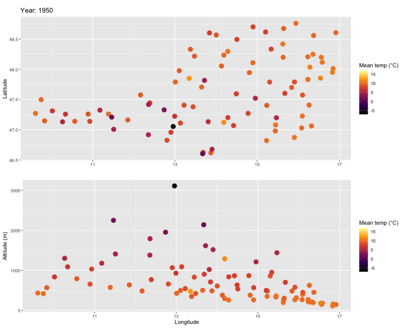

# meteo — Austrian Temperature Data Pipeline

A data pipeline that downloads weather station data from the
GeoSphere Austria API, stores it in a 
MySQL database, and analyzes monthly temperature anomalies for 2025
against the 1990–2019 reference period.

Group project for the course *Introduction into Data Management*
(Minor: Digital Science) at the University of Innsbruck.



## Workflow

1. **Station metadata** — download station info from the API and store it
   in the database (`src/01_create_station_table.R`)
2. **Observations** — download daily temperature observations
   (`tlmin`, `tlmax`, `tl_mittel`), clean missing values, and insert them
   into the database (`src/02_create_observation_table.py`)
3. **Analysis** — compute monthly temperature anomalies for 2025 vs. the
   1990–2019 reference period (`src/03_analysis.R`)
4. **Visualization** — plots and animation of anomalies across Austria

## Project structure
```
.
├── src/
│   ├── 01_create_station_table.R       # station metadata → DB
│   ├── 02_create_observation_table.py  # observations → DB (incl. NA cleaning)
│   ├── 03_analysis.R                   # anomaly computation & plots
│   ├── functions.py                    # Python helpers (API, caching, DB insertion)
│   └── functions.R                     # R helpers
├── plots/                              # generated figures & animation
├── docs/                               # project presentation (PDF)
├── requirements.txt
└── .env_template
```
## Setup

**Requirements:** Python 3.x, R, access to a MySQL database.

```bash
pip install -r requirements.txt
```

R packages: <list them, e.g. dotenv, DBI, RMariaDB, ggplot2, ...>

**Database credentials** are stored in `.env` and loaded by the scripts:

* *R*: the [`dotenv`](http://cran.r-project.org/package=dotenv) package —
  `dotenv::load_dot_env(".env")`, then `Sys.getenv("DB_USER")`
* *Python*: the [`python-dotenv`](https://pypi.org/project/python-dotenv/)
  package — `dotenv.load_dotenv(".env")`, then `os.getenv("DB_USER")`

Copy `.env_template` to `.env` and add your credentials (git-ignored).

## Run

Execute the scripts in numbered order:

```bash
Rscript src/01_create_station_table.R
python src/02_create_observation_table.py
Rscript src/03_analysis.R
```

## Results

At the analyzed station, 2025 was clearly warmer than the 1990–2019
reference: 10 of 12 months showed positive anomalies, averaging about
+1.6 °C over the year. June stood out with +4.0 °C above the baseline,
followed by February (+3.3 °C) and April (+3.1 °C); only May and July
were marginally below the reference. 

## Team & contributions

Group project (4 students) for the course *Introduction into
Data Management* at the University of Innsbruck.

**My contributions:**
- **Database layer (Python):** built the observations pipeline
  (`02_create_observation_table.py`) — fetching temperature observations
  from the API for the stations selected in the station table, and
  inserting them into the database with batch inserts and duplicate
  handling
- **Caching:** added a local cache for API responses, so repeated runs
  during development and testing didn't re-download the data
- **Logging:** added logging across the pipeline scripts to make runs
  traceable and debugging faster
- **Version control:** Git workflow and merge conflict resolution

The R analysis and visualization layer was implemented by teammates.